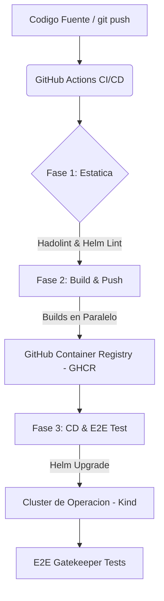
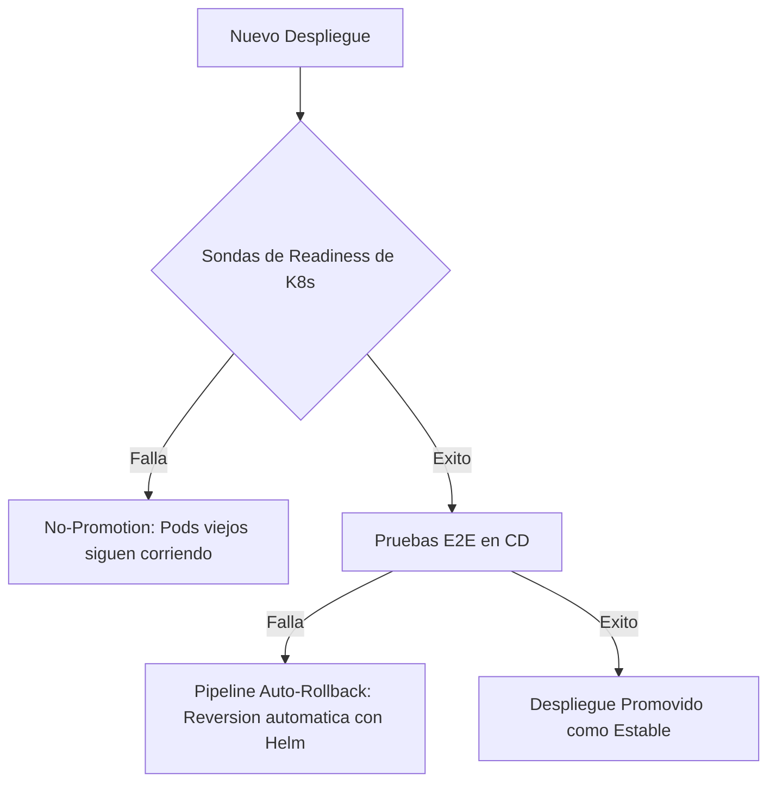

# Guia de Implementacion: Helm & GitHub Actions para "The Store"
## Redes de Informacion - Trabajo Practico Especial (Grupo 15)

Esta guia detalla la arquitectura de la solucion de **CI/CD, Despliegue y Gestion de los Servicios** implementada para **"The Store"**, basandose en la propuesta de la Pre-Entrega y las especificaciones del enunciado del TPE.

---

## 1. Arquitectura de la Solucion

Para superar las deficiencias del despliegue monolitico original (`kubernetes.yaml` de 18KB), se evoluciono la infraestructura hacia un estandar moderno de la industria basado en dos pilares:



### A. Gestion de Configuracion: Helm Umbrella Chart
Se diseño un **Umbrella Chart** denominado `the-store` en el directorio `charts/the-store/` que actua como contenedor principal. El ciclo de vida de los microservicios se delega de forma modular y desacoplada a traves de sub-charts localizados en `charts/the-store/charts/`:

*   **`catalog`**: Servicio de catalogo.
*   **`cart`**: Servicio de carrito de compras (recursos K8s renombrados a `carts` para compatibilidad).
*   **`checkout`**: Servicio de procesamiento de pagos y ordenes.
*   **`orders`**: Servicio de gestion de pedidos.
*   **`ui`**: Interfaz de usuario expuesta al exterior mediante un recurso **Ingress** administrado por NGINX.

#### Parametrizacion y Control Dinamico
Todas las configuraciones rigidas del manifiesto original se parametrizaron en `values.yaml`, permitiendo modificar dinamicamente:
1.  **Replicas**: Configurable por servicio (ej. `catalog.replicaCount`).
2.  **Limites de Recursos**: Requests y limits de CPU y Memoria detallados por microservicio para optimizar la asignacion y evitar degradaciones de hardware.
3.  **Probes de Readiness**: Rutas y tiempos de delay dinamicos para garantizar despliegues progresivos sin perdida de servicio.
4.  **Inyeccion de Credenciales**: Los secrets de base de datos se parametrizan en plaintext en `values.yaml` y son inyectados dinamicamente mediante la funcion `b64enc` de Helm, abstrayendo al operador de la codificacion manual.

---

## 2. Guia del Desarrollador: Uso Local

Se extendio el script imperativo original `local.sh` para integrar soporte nativo de **Helm**, deteccion automatica del binario e inicializacion configurable para CI.

### Prerrequisitos
Tener instalado Docker en la maquina local.

### Comandos Principales

#### 1. Crear el Cluster Kind y Desplegar con Helm
Para iniciar un cluster local, instalar el controlador Nginx Ingress, compilar las imagenes de Docker locales y desplegar la aplicacion usando el Umbrella Chart de Helm, ejecute:
```bash
./local.sh create-cluster
```
*   *Nota*: El script buscara el ejecutable `helm` en su variable `PATH`. Si no lo encuentra, buscara de forma segura en `$HOME/.local/bin/helm`.

#### 2. Comprobar el Estado de los Recursos
Una vez finalizado el despliegue, verifique que los Pods, Services, Ingresses y ServiceAccounts esten creados correctamente en el namespace:
```bash
./local.sh status
```

#### 3. Ejecutar Pruebas E2E en Local
Para validar el correcto direccionamiento IP y la consistencia del trafico gRPC/HTTP inter-pod:
```bash
./local.sh e2e-test
```

#### 4. Destruir el Cluster
Cuando termine de probar, limpie todo el entorno de trabajo ejecutando:
```bash
./local.sh delete-cluster
```

---

## 3. Automatizacion: Pipeline de GitHub Actions

El pipeline centralizado se define en `.github/workflows/main.yml`. Su ejecucion se compone de tres etapas estructuradas en base a las mejores practicas de Integracion y Despliegue Continuo.

### Etapa 1: Validacion Estatica (`static-validation`)
*   Se ejecuta automaticamente en cada **push** y **pull request** a la rama `main`.
*   **Hadolint**: Realiza un analisis estatico de los `Dockerfile` de cada servicio para asegurar buenas practicas de construccion (minimizar capas, evitar dependencias debiles, uso de imagenes base minimalistas y seguras).
*   **Helm Lint**: Valida que la estructura del Umbrella Chart y la sintaxis de las plantillas YAML de los sub-charts respeten el estandar oficial de Helm.

### Etapa 2: Construccion y Registro (`build-and-push`)
*   Se activa unicamente en commits integrados directamente en la rama principal `main`.
*   **Construccion en Paralelo**: Implementa una estrategia de **matrix** en GitHub Actions que compila simultaneamente el codigo de los 5 microservicios (`catalog`, `cart`, `checkout`, `orders`, `ui`) utilizando el cache distribuido (`type=gha`).
*   **Versionado Semantico Automatico**: Las imagenes Docker compiladas se taggean inmutablemente usando:
    *   El **Commit SHA** corto (ej: `sha-a1b2c3d`).
    *   La etiqueta flotante `latest`.
*   **Registro Inmutable**: Las imagenes se publican de forma segura en el **GitHub Container Registry (GHCR)** asociadas al repositorio correspondiente (`ghcr.io/OWNER/REPOSITORY/the-store-SERVICE`).

### Etapa 3: Despliegue y Pruebas E2E (`deploy-and-test`)
*   Actua como la **compuerta final (Gatekeeper)** antes de considerar estable una version.
*   **Cluster Transitorio**: Levanta un cluster Kind efimero e instala el Nginx Ingress Controller.
*   **Consumo de GHCR**: Descarga las imagenes inmutables construidas en la etapa anterior utilizando el tag especifico del Commit SHA actual.
*   **Helm CD**: Ejecuta `helm upgrade --install` instalando el chart `charts/the-store` y seteando dinamicamente la variable global `global.imageTag` con el tag del Commit SHA.
*   **Pruebas E2E**: Ejecuta la suite completa de pruebas de extremo a extremo (`local.sh e2e-test`). Si ocurre alguna falla, el pipeline se aborta marcando la compilacion como fallida y bloqueando cualquier promocion.

---

## 4. Gestion ante Desastres: Rollback (Caso 3 de la POC)

Uno de los principales beneficios de utilizar Helm es la trazabilidad completa del historial de versiones y la capacidad de revertir de forma segura cambios defectuosos de manera instantanea.

### Estrategia de Proteccion: K8s "No-Promotion" vs. "Pipeline Auto-Rollback"

Existen **dos lineas de defensa criticas** en nuestra estrategia de deployment cuando se detectan fallas:



1.  **Linea de Defensa 1 (Nivel Kubernetes - No-Promotion)**:
    *   **Estrategia**: `RollingUpdate` combinada con sondas de `ReadinessProbe` y recursos de control de fallas (`maxUnavailable` y `maxSurge`).
    *   **Comportamiento**: Si se despliega una imagen rota, defectuosa o con problemas de red (que hace fallar el probe), Kubernetes **detiene el rollout inmediatamente**. Mantiene las replicas del deployment anterior (estable) sirviendo trafico y **no promueve** las nuevas. El operador puede ver la falla sin haber causado degradacion de servicio a los usuarios finales.
2.  **Linea de Defensa 2 (Nivel Pipeline - Auto-Rollback)**:
    *   **Estrategia**: Compuerta de Pruebas E2E (`local.sh e2e-test`) integrada directamente en el paso de CD del pipeline.
    *   **Comportamiento**: Si los pods logran ponerse en estado `Ready` (es decir, K8s los promueve porque pasan los probes iniciales), pero **las pruebas logicas E2E fallan** (ej. un bug de negocio en gRPC o comunicacion inter-pod), el pipeline de GitHub Actions captura el codigo de retorno fallido de las pruebas y ejecuta **un rollback automatico de Helm (`helm rollback`)** restaurando de forma inminente el ultimo release estable sin intervencion humana.

### Simulacion de Falla (Despliegue Incorrecto)
Imagine que se introduce un cambio defectuoso (ejemplo: una imagen inexistente o un cambio en las sondas de salud del servicio `catalog` que le impiden entrar en estado `Ready`).

Al intentar desplegar dicha version defectuosa:
1.  Kubernetes mantendra el pod viejo corriendo y no permitira que el pod defectuoso reciba trafico gracias a la estrategia de **RollingUpdate**.
2.  Sin embargo, el despliegue quedara colgado o marcara una falla.

### Procedimiento de Rollback en Produccion

#### 1. Inspeccionar el Historial de Versiones
Para listar los releases historicos gestionados por Helm, ejecute:
```bash
# Cambie "the-store" por el nombre de su release y use el namespace correcto
helm history the-store -n the-store
```

Verá una salida similar a la siguiente:
| REVISION | UPDATED                  | STATUS   | CHART           | APP VERSION | DESCRIPTION      |
|----------|--------------------------|----------|-----------------|-------------|------------------|
| 1        | Sat May 30 14:00:00 2026 | superseded| the-store-1.0.0 | 1.0.0       | Install complete |
| 2        | Sat May 30 14:15:00 2026 | failed   | the-store-1.0.0 | 1.0.0       | Upgrade failed   |

#### 2. Revertir a la Revision Estable
Identificando que la revision `1` es la ultima version estable del cluster, ejecute el rollback:
```bash
helm rollback the-store 1 -n the-store
```

**¿Que sucede internamente?**
*   Helm se comunica con el API Server de Kubernetes.
*   Determina los recursos que difieren entre la especificacion de la revision `2` y la revision `1`.
*   Aplica inmediatamente los cambios necesarios en los Deployments, redireccionando las replicas activas a las imagenes de Docker inmutables previas en GHCR.
*   **Resultado**: El cluster se recupera en segundos sin sufrir perdida de disponibilidad.

---

## 5. Configuracion del Agente Local (Self-Hosted Runner)

Tal como se propuso en el diseño de la Pre-Entrega, el pipeline de CD (despliegue) esta diseñado para ejecutarse sobre un **Self-Hosted Runner** instalado en la maquina local (donde reside de manera persistente el cluster de Kubernetes/Kind).

### ¿Por que usar un Self-Hosted Runner?
1.  **Seguridad y Aislamiento de Red**: Evita la necesidad de exponer la API de Kubernetes de la maquina local (puerto 6443/TCP) o abrir puertos hacia el exterior.
2.  **Acceso Nativo**: Al correr directamente en el host del desarrollador o del servidor, el runner tiene acceso directo a la configuracion de Kubernetes (`~/.kube/config`) y a la API de Docker local.

### Paso a Paso para Configurar el Runner Local

Para que GitHub Actions pueda comunicarse con el cluster Kind local durante la presentacion, se debe registrar la maquina local como agente:

1.  **Registrar el Runner en GitHub**:
    *   Vaya a su repositorio en GitHub.
    *   Navegue a **Settings** -> **Actions** -> **Runners**.
    *   Haga clic en **New self-hosted runner** y seleccione el sistema operativo (ej. **Linux**, arquitectura x64).
    *   Siga las instrucciones en la consola de su maquina local para descargar, configurar y registrar el agente.
    *   *Sugerencia*: Al configurarlo, asignele el tag o etiqueta **`self-hosted`**.

2.  **Iniciar el Agente**:
    *   Ejecute el script del runner en segundo plano o en una consola dedicada:
        ```bash
        ./run.sh
        ```
    *   El runner aparecera con estado `Idle` (Listo) en la interfaz de GitHub.

### Adaptacion del Workflow para Produccion/Presentacion

El archivo `.github/workflows/main.yml` actual utiliza `runs-on: self-hosted` para ejecutar el CD en el runner local. Para volver a ejecutar de forma efimera en la nube de GitHub, se modificaria a `runs-on: ubuntu-latest`.
